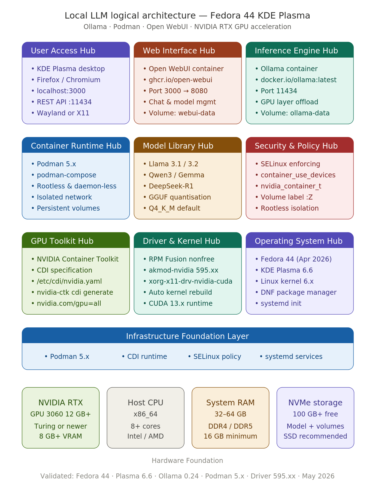

# Ollama + Podman + Open WebUI on Fedora 44 KDE Plasma

**Complete production-ready local LLM setup with full NVIDIA RTX GPU acceleration**

**Last updated:** 24 May 2026

> **Validated against:** Fedora 44 KDE Plasma (released 28 April 2026), KDE Plasma 6.6, Ollama v0.24.0, RPM Fusion driver branch 595.xx, NVIDIA Container Toolkit (CDI method), Podman 5.x

---

## Table of Contents

- [Introduction](#introduction)
- [System Requirements](#system-requirements)
- [Pre-Installation Checklist](#pre-installation-checklist)
- [Step-by-Step Installation](#step-by-step-installation)
  - [Step 1: Update Fedora and Install Core Tools](#step-1-update-fedora-and-install-core-tools)
  - [Step 2: Enable RPM Fusion Repositories](#step-2-enable-rpm-fusion-repositories)
  - [Step 3: Install NVIDIA Drivers via RPM Fusion](#step-3-install-nvidia-drivers-via-rpm-fusion)
  - [Step 4: Configure SELinux for GPU Container Access](#step-4-configure-selinux-for-gpu-container-access)
  - [Step 5: Install the NVIDIA Container Toolkit](#step-5-install-the-nvidia-container-toolkit)
  - [Step 6: Generate the CDI Specification](#step-6-generate-the-cdi-specification)
  - [Step 7: Verify GPU Passthrough into Podman](#step-7-verify-gpu-passthrough-into-podman)
  - [Step 8: Create the Project Directory](#step-8-create-the-project-directory)
  - [Step 9: Create the compose.yml](#step-9-create-the-composeyml)
  - [Step 10: Start the Services](#step-10-start-the-services)
  - [Step 11: Access Open WebUI](#step-11-access-open-webui)
  - [Step 12: Pull Your First Model](#step-12-pull-your-first-model)
- [Management Commands](#management-commands)
- [Troubleshooting](#troubleshooting)
- [Advanced GPU Optimisation](#advanced-gpu-optimisation)
- [Contributing](#contributing)

---

## Introduction

This guide provides a clean, secure, and fully maintainable method to run **Ollama** with **Open WebUI** on **Fedora 44 KDE Plasma** using **Podman**.

Fedora 44 was released on 28 April 2026 and ships with **KDE Plasma 6.6**, which introduces the new Plasma Login Manager (replacing SDDM) and the Plasma Setup wizard. It is the recommended desktop environment for NVIDIA GPU workloads on Fedora, as KDE continues to offer a full X11 session option alongside Wayland — a practical advantage when working with proprietary NVIDIA drivers.

Podman is the native container engine on Fedora, offering rootless operation, native SELinux integration, and daemon-less architecture. It is the recommended alternative to Docker for Fedora-based workloads and is fully compatible with Docker Compose syntax via `podman-compose`.

GPU passthrough into Podman containers is handled using the **Container Device Interface (CDI)** specification, generated by the NVIDIA Container Toolkit. This approach is stable, rootless-compatible, and does not require disabling SELinux.

> **Important note regarding NVIDIA CUDA repositories:** As of May 2026, NVIDIA has not yet published an official `cuda-fedora44.repo` for Fedora 44. NVIDIA typically lags several months behind new Fedora releases. The **RPM Fusion** repository is therefore the validated and recommended driver installation method for Fedora 44. It provides automatic kernel module rebuilds via `akmods`, Secure Boot compatibility, and timely updates through DNF.

Fully tested and validated on RTX 3060 12 GB and higher GPUs.

---

## Architecture Overview

The diagram above illustrates the complete reference architectures  stack: from the engineer's browser session at the top, through the Open WebUI and Ollama containers running inside Podman, down to the NVIDIA Container Toolkit, RPM Fusion drivers, Fedora 44 operating system, and finally the underlying RTX GPU hardware foundation.

---

## System Requirements

### Minimum

| Component | Requirement |
|-----------|------------|
| Operating System | Fedora 44 KDE Plasma Desktop Edition |
| CPU | 4-core x86\_64 processor |
| RAM | 16 GB |
| GPU | NVIDIA RTX 20-series (Turing) or newer with 8 GB+ VRAM |
| Storage | 50 GB free space (SSD strongly recommended) |
| Internet | Required for initial package downloads |

### Recommended (RTX 3060 12 GB or better)

| Component | Requirement |
|-----------|------------|
| Operating System | Fedora 44 KDE Plasma Desktop Edition (fresh install) |
| CPU | 8+ cores (Intel Core i7 / AMD Ryzen 7 or better) |
| RAM | 32 GB to 64 GB |
| GPU | NVIDIA RTX 3060 12 GB, RTX 4070, RTX 4080, RTX 4090 or newer |
| Storage | NVMe SSD with 100 GB+ free space |
| Internet | Broadband (models range from 2 GB to 70 GB+ in size) |

> **GPU VRAM guidance:** A 12 GB card comfortably runs 7B and 13B quantised models. A 24 GB card accommodates 34B models. For 70B models, 48 GB+ VRAM is recommended, or use quantised variants (Q4\_K\_M) on 24 GB.

---

## Pre-Installation Checklist

Before proceeding, confirm the following:

- [ ] Fedora 44 KDE Plasma is installed and booting correctly
- [ ] You have `sudo` privileges on the system
- [ ] Secure Boot status is known (`mokutil --sb-state`)
- [ ] The NVIDIA GPU is detected by the system (`lspci | grep -i nvidia`)
- [ ] Internet connectivity is active

---

## Step-by-Step Installation

### Step 1: Update Fedora and Install Core Tools

Begin with a full system update to ensure all packages are at their latest versions before adding new repositories or drivers.

## bash
sudo dnf update -y

## install podman

sudo dnf install -y podman 
podman-compose curl

**Expected output:**

Complete!

Verify the installed versions:

## bash
### podman --version
podman-compose --version

**Expected output (versions may be higher):**

podman-compose version 1.x.x 

podman version 5.x.x

> If a kernel update was installed, **reboot now** before continuing:
>
> ## bash
> sudo reboot
> 

---

### Step 2: Enable RPM Fusion Repositories

RPM Fusion is the validated source for NVIDIA proprietary drivers on Fedora 44. Both the `free` and `nonfree` repositories must be enabled, as the NVIDIA driver packages reside in `nonfree`.

## bash
sudo dnf install -y https://mirrors.rpmfusion.org/free/fedora/rpmfusion-free-release-$(rpm -E %fedora).noarch.rpm https://mirrors.rpmfusion.org/nonfree/fedora/rpmfusion-nonfree-release-$(rpm -E %fedora).noarch.rpm

### Update the system and refresh repositories
sudo dnf update -y

**Expected output:**

Installed:
  rpmfusion-free-release-44.noarch
  rpmfusion-nonfree-release-44.noarch

Complete!

Confirm the repositories are active:

## bash
dnf repolist | grep rpmfusion

**Expected output:**

rpmfusion-free          RPM Fusion for Fedora 44 - Free
rpmfusion-nonfree       RPM Fusion for Fedora 44 - Nonfree

---

### Step 3: Install NVIDIA Drivers via RPM Fusion

The `akmod-nvidia` package uses the **automatic kernel module (akmod)** system, which rebuilds the driver automatically whenever the kernel updates. This is the recommended approach for all RTX 20-series and newer GPUs on Fedora 44 (driver branch 595.xx).

## bash
# Ensure the system is on the latest kernel before installing the driver
sudo dnf update -y

# Install the NVIDIA driver and optional CUDA support libraries
sudo dnf install -y akmod-nvidia xorg-x11-drv-nvidia-cuda

**Expected output:**

Installed:
  akmod-nvidia-3:595.xx.xx-1.fc44.x86_64
  xorg-x11-drv-nvidia-cuda-3:595.xx.xx-1.fc44.x86_64
  ...
Complete!

> **Critical:** Do NOT reboot immediately. The `akmods` system must compile the kernel module first. Wait for the build to complete (this can take up to 5 minutes on some systems):

## bash
# Wait for the module to build, then verify
modinfo -F version nvidia

**Expected output (version number confirms a successful build):**

595.xx.xx

If the output shows `modinfo: ERROR: Module nvidia not found`, the build has not yet completed. Wait a further minute and re-run the command. Only reboot once a version number is returned.

## bash
sudo reboot

**After reboot, verify the driver is loaded:**

## bash
nvidia-smi

**Expected output:**

+-----------------------------------------------------------------------------------------+
| NVIDIA-SMI 595.xx.xx    Driver Version: 595.xx.xx    CUDA Version: 13.x               |
+-----------------------------------------+------------------------+----------------------+
| GPU  Name                 Persistence-M | Bus-Id          Disp.A | Volatile Uncorr. ECC |
| Fan  Temp   Perf          Pwr:Usage/Cap |         Memory-Usage   | GPU-Util  Compute M. |
|                                         |                        |               MIG M. |
|=========================================+========================+======================|
|   0  NVIDIA GeForce RTX 3060       Off  | 00000000:01:00.0  On   |                  N/A |
|  30%   42C    P8              10W / 170W |    512MiB / 12288MiB   |      0%      Default |
|                                         |                        |                  N/A |
+-----------------------------------------+------------------------+----------------------+

---

### Step 4: Configure SELinux for GPU Container Access

Fedora 44 runs SELinux in **Enforcing** mode by default. The default policy prevents containers from accessing GPU devices directly. This boolean must be enabled persistently before container GPU passthrough will work.

## bash
# Confirm SELinux is currently enforcing
getenforce

**Expected output:**

Enforcing

Enable device access for containers:

## bash
sudo setsebool -P container_use_devices on

**Verify the boolean is set:**

## bash
getsebool container_use_devices

**Expected output:**

container_use_devices --> on

> **Note:** The `-P` flag makes this change persistent across reboots. Do not omit it.

---

### Step 5: Install the NVIDIA Container Toolkit

The NVIDIA Container Toolkit enables GPU access inside Podman containers. It is sourced from NVIDIA's official libnvidia-container repository.

## bash
# Add the NVIDIA Container Toolkit repository for RHEL/Fedora
curl -s -L https://nvidia.github.io/libnvidia-container/stable/rpm/nvidia-container-toolkit.repo | \
  sudo tee /etc/yum.repos.d/nvidia-container-toolkit.repo

# Install the toolkit
sudo dnf install -y nvidia-container-toolkit

**Expected output:**

Installed:
  nvidia-container-toolkit-x.x.x-1.x86_64
Complete!

---

### Step 6: Generate the CDI Specification

The Container Device Interface (CDI) specification tells Podman exactly how to expose the NVIDIA GPU to containers. It must be generated after driver installation and regenerated any time the driver is updated.

## bash
# Create the CDI directory if it does not already exist
sudo mkdir -p /etc/cdi

# Generate the CDI specification
sudo nvidia-ctk cdi generate --output=/etc/cdi/nvidia.yaml

**Expected output:**

INFO[0000] Auto-detected mode as 'nvml'
INFO[0000] Selecting /dev/nvidia0 as /dev/nvidia0
INFO[0001] Generated CDI spec with version 0.5.0

Verify the specification was created and lists the GPU:

## bash
nvidia-ctk cdi list

**Expected output:**

nvidia.com/gpu=0
nvidia.com/gpu=all

---

### Step 7: Verify GPU Passthrough into Podman

Before deploying the full stack, confirm that Podman can successfully pass the GPU through to a container. This is the most important validation step.

## bash
podman run --rm \
  --device nvidia.com/gpu=all \
  --security-opt label=disable \
  docker.io/nvidia/cuda:12.3.0-base-ubuntu22.04 \
  nvidia-smi

**Expected output:**

+-----------------------------------------------------------------------------------------+
| NVIDIA-SMI 595.xx.xx    Driver Version: 595.xx.xx    CUDA Version: 13.x               |
...
|   0  NVIDIA GeForce RTX 3060       Off  | 00000000:01:00.0   On  |                  N/A |
...

> If you receive a permissions or NVML error, re-check Step 4 (SELinux boolean) and Step 6 (CDI spec). The CDI spec must be regenerated after any driver update.

---

### Step 8: Create the Project Directory

## bash
mkdir -p ~/ollama-podman
cd ~/ollama-podman

---

### Step 9: Create the compose.yml

Create the Podman Compose file. The `:Z` volume suffix instructs Podman to apply the correct SELinux label to the volume automatically, which is required on Fedora.

## bash
nano ~/ollama-podman/compose.yml

Paste the following content:

yaml
# compose.yml
# Ollama + Open WebUI on Fedora 44 KDE Plasma with NVIDIA GPU (CDI method)
# Validated: May 2026

services:

  ollama:
    image: docker.io/ollama/ollama:latest
    container_name: ollama
    ports:
      - "11434:11434"
    environment:
      - OLLAMA_HOST=0.0.0.0:11434
    volumes:
      - ollama-data:/root/.ollama:Z
    devices:
      - nvidia.com/gpu=all
    security_opt:
      - label=type:nvidia_container_t
    restart: unless-stopped
    healthcheck:
      test: ["CMD", "ollama", "list"]
      interval: 30s
      timeout: 10s
      retries: 3
      start_period: 40s

  open-webui:
    image: ghcr.io/open-webui/open-webui:main
    container_name: open-webui
    depends_on:
      ollama:
        condition: service_healthy
    ports:
      - "3000:8080"
    environment:
      - OLLAMA_BASE_URL=http://ollama:11434
      - WEBUI_SECRET_KEY=${WEBUI_SECRET_KEY:-change-me-in-production}
      - ENABLE_SIGNUP=true
    volumes:
      - open-webui-data:/app/backend/data:Z
    restart: unless-stopped

volumes:
  ollama-data:
    driver: local
  open-webui-data:
    driver: local

Save and exit: `Ctrl+O`, `Enter`, `Ctrl+X`

> **Security note:** For any internet-facing deployment, replace `change-me-in-production` with a strong, randomly generated secret key and set `ENABLE_SIGNUP=false` after creating your initial account.

---

### Step 10: Start the Services

## bash
cd ~/ollama-podman
podman-compose up -d

**Expected output:**

[+] Running 2/2
 Container ollama       Started
 Container open-webui   Started

Confirm both containers are running:

## bash
podman ps

**Expected output:**

CONTAINER ID  IMAGE                                       COMMAND               CREATED        STATUS                   PORTS                    NAMES
a1b2c3d4e5f6  docker.io/ollama/ollama:latest              /bin/ollama serve     10 seconds ago Up 9 seconds (healthy)   0.0.0.0:11434->11434/tcp ollama
f6e5d4c3b2a1  ghcr.io/open-webui/open-webui:main          bash start.sh         8 seconds ago  Up 7 seconds             0.0.0.0:3000->8080/tcp   open-webui

---

### Step 11: Access Open WebUI

Open your browser and navigate to:

http://localhost:3000

On first access, Open WebUI will prompt you to create an administrator account. The first account registered automatically receives administrator privileges.

---

### Step 12: Pull Your First Model

Once the services are running, pull a model directly from the terminal or from within the Open WebUI interface.

**Via terminal (recommended for large models):**

## bash
# Lightweight model suitable for 8 GB+ VRAM (approximately 2 GB download)
podman exec -it ollama ollama pull llama3.2:3b

# Recommended general-purpose model for RTX 3060 12 GB (approximately 4.7 GB download)
podman exec -it ollama ollama pull llama3.1:8b

# High-quality reasoning model for RTX 3060 12 GB (approximately 5 GB download)
podman exec -it ollama ollama pull qwen3:8b

**Expected output:**

pulling manifest
pulling 8eeb52dfb3bb... 100% |████████████████| 4.7 GB
pulling 04de533bb8fd... 100% |████████████████| 1.2 KB
verifying sha256 digest
writing manifest
success

List available models:

## bash
podman exec -it ollama ollama list

**Expected output:**

NAME               ID              SIZE    MODIFIED
llama3.1:8b        42182419e950    4.7 GB  2 minutes ago

---

## Management Commands

### Service Control

## bash
# View all running containers
podman ps

# Start services
cd ~/ollama-podman && podman-compose up -d

# Stop services
cd ~/ollama-podman && podman-compose down

# Restart a specific container
podman restart ollama
podman restart open-webui

### Logs and Monitoring

## bash
# Follow Ollama logs
podman logs -f ollama

# Follow Open WebUI logs
podman logs -f open-webui

# Monitor GPU utilisation in real time
watch -n 1 nvidia-smi

# Check GPU memory usage by running processes
nvidia-smi --query-compute-apps=pid,used_memory --format=csv

# Monitor container resource usage
podman stats --no-stream

### Updating

## bash
# Pull latest images and recreate containers
cd ~/ollama-podman
podman-compose pull
podman-compose up -d

# After a driver update, regenerate the CDI spec
sudo nvidia-ctk cdi generate --output=/etc/cdi/nvidia.yaml

### Model Management

## bash
# List all downloaded models
podman exec -it ollama ollama list

# Pull a model
podman exec -it ollama ollama pull <model-name>

# Remove a model
podman exec -it ollama ollama rm <model-name>

# Show model information
podman exec -it ollama ollama show <model-name>

---

## Troubleshooting

### GPU not detected inside the container

## bash
# Verify the CDI spec lists your GPU
nvidia-ctk cdi list

# Regenerate the CDI spec
sudo nvidia-ctk cdi generate --output=/etc/cdi/nvidia.yaml

# Confirm SELinux boolean is enabled
getsebool container_use_devices

# Re-enable if necessary
sudo setsebool -P container_use_devices on

# Check if the NVIDIA kernel module is loaded
lsmod | grep nvidia

# If the module is not loaded, load it manually
sudo modprobe nvidia

### SELinux AVC denial errors

## bash
# Search for recent SELinux denials related to NVIDIA
sudo ausearch -m avc -ts recent | grep nvidia

# Apply the persistent fix
sudo setsebool -P container_use_devices on

### Ollama container exits immediately

## bash
# Check container logs for the error message
podman logs ollama

# Confirm the CDI spec exists
ls -la /etc/cdi/nvidia.yaml

### Open WebUI cannot connect to Ollama

## bash
# Verify Ollama is healthy
podman inspect ollama | grep -i health

# Test the Ollama API directly
curl http://localhost:11434/api/tags

### Driver not loading after a kernel update

The `akmods` system handles kernel module rebuilds automatically. If the driver fails to load after a kernel update:

## bash
# Force a rebuild of the kernel module
sudo akmods --force

# Then reboot
sudo reboot

### CDI spec becomes stale after a driver update

Any time `akmod-nvidia` installs a new driver version, regenerate the CDI specification:

## bash
sudo nvidia-ctk cdi generate --output=/etc/cdi/nvidia.yaml
nvidia-ctk cdi list

---

## Advanced GPU Optimisation

### Confirm GPU layers are being used by Ollama

When running a model, the Ollama logs should indicate that layers have been offloaded to the GPU:

## bash
podman logs -f ollama

Look for lines similar to:

llm server loading model
...
llama_model_load: offloading 32 repeating layers to GPU
llama_model_load: offloading non-repeating layers to GPU
llama_model_load: offloaded 33/33 layers to GPU

### Recommended models by VRAM

| VRAM | Recommended Models |
|------|--------------------|
| 8 GB | `llama3.2:3b`, `gemma2:2b`, `phi3:mini` |
| 12 GB | `llama3.1:8b`, `qwen3:8b`, `mistral:7b` |
| 16 GB | `llama3.1:13b`, `qwen3:14b` |
| 24 GB | `llama3.1:33b`, `qwen3:32b` (Q4\_K\_M) |
| 48 GB+ | `llama3.1:70b` (Q4\_K\_M), `qwen3:72b` (Q4\_K\_M) |

### Enable Ollama GPU memory persistence

To keep the GPU context loaded between requests and reduce inference startup latency, set the `OLLAMA_KEEP_ALIVE` environment variable in `compose.yml`:

yaml
environment:
  - OLLAMA_HOST=0.0.0.0:11434
  - OLLAMA_KEEP_ALIVE=24h

Recreate the container after modifying the compose file:

## bash
podman-compose up -d

---

## Contributing

Contributions, corrections, and improvements are welcome. Please open an issue or submit a pull request.

If this guide has been helpful, consider leaving a star on the repository.

---

## References

- [Fedora 44 Release Announcement - Fedora Magazine](https://fedoramagazine.org/announcing-fedora-linux-44/)
- [What's New in Fedora KDE Plasma Desktop 44 - Fedora Magazine](https://fedoramagazine.org/whats-new-in-fedora-kde-plasma-desktop-44/)
- [RPM Fusion NVIDIA Driver Guide](https://rpmfusion.org/Howto/NVIDIA)
- [NVIDIA Container Toolkit Documentation](https://docs.nvidia.com/datacenter/cloud-native/container-toolkit/latest/index.html)
- [CDI Support - NVIDIA Container Toolkit](https://docs.nvidia.com/datacenter/cloud-native/container-toolkit/latest/cdi-support.html)
- [GPU Access in Podman - Podman Desktop Documentation](https://podman-desktop.io/docs/podman/gpu)
- [Ollama GitHub Repository](https://github.com/ollama/ollama)
- [Open WebUI GitHub Repository](https://github.com/open-webui/open-webui)

---

*Maintained by the community. Not affiliated with Fedora Project, NVIDIA, Ollama, or Open WebUI.*
